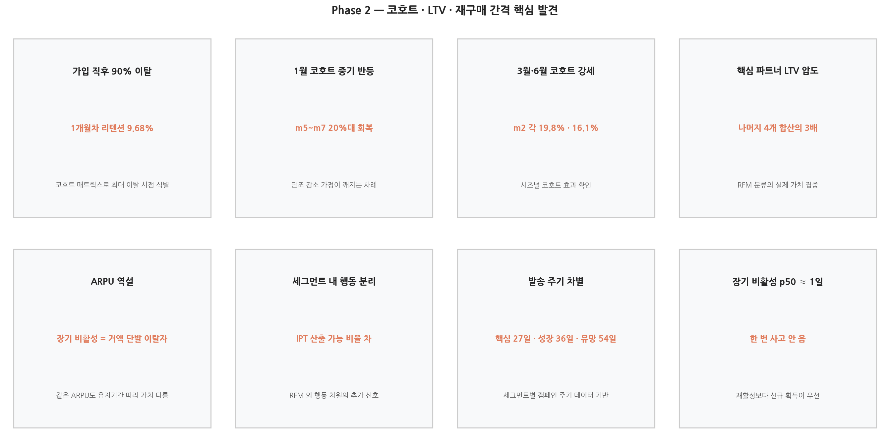
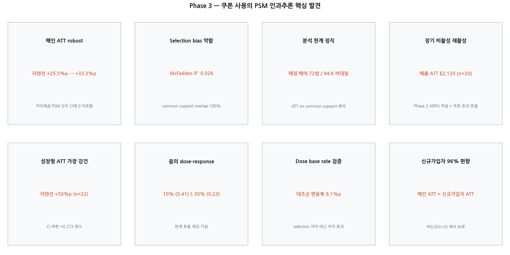

# 이커머스 고객 행동 데이터 기반 세분화·코호트 분석·인과추론 및 마케팅 전략 제안

> 거래 52,924건·고객 1,468명의 이커머스 행동 데이터를 RFM 세그먼테이션·코호트 리텐션·PSM 인과추론 흐름으로 분석한 데이터 분석 프로젝트입니다. **장기 비활성 고객의 ARPU 역설**과 **음의 dose-response 쿠폰 효과** 같이 단순 비교로는 보이지 않는 인과 시그널을 정량적으로 드러내고, 이를 세그먼트별 발송 주기·예산 배분·A/B 테스트 설계까지 마케팅 액션으로 연결합니다.

<br>

## 1. 프로젝트 개요

| 항목 | 내용 |
|---|---|
| 분석 주제 | RFM 세그먼테이션 + 코호트 리텐션 + PSM 인과추론 + A/B 테스트 설계 + BI 대시보드 |
| 분석 기간 | 2025.03 (1차, 4인 팀) → 2026.05~ 진행 중 (단독 심화) |
| 본인 역할 | 1차: EDA·전처리·결과 해석·시각화 (기여도 30%) / 2차: SQL 재구축·인과추론·A/B 설계·BI 대시보드 단독 |
| 데이터 출처 | 데이콘 이커머스 고객 세분화 분석 아이디어 경진대회 (2024) — 거래 52,924건 / 고객 1,468명 / 2019년 1년치 |
| 핵심 도구 | BigQuery · SQL (CTE · NTILE · 윈도우 함수) · Python (pandas · statsmodels · scikit-learn) · Tableau Public |
| 주요 산출물 | 5개 세그먼트 / Funnel 분석 / 코호트 매트릭스 / PSM ATT / A/B 설계서 / 시각화 PNG 다수 |

<br>

## 2. 분석 요약 (Key Findings)

- **세그먼트 가치 집중도** — 5개 세그먼트 중 **핵심 파트너 단독 LTV가 나머지 4개 세그먼트 합산의 3.2배**. 핵심 파트너 + 성장형이 전체 매출의 **약 68~70%** 차지.
- **가입 직후 90% 이탈** — 1개월차 평균 리텐션 **9.68%**. Funnel의 *첫 구매→재구매* 단계가 가장 큰 이탈 지점(전환율 8.51%)으로 코호트 관점에서 동일 시점에 재확인됨.
- **PSM ATT 결과 robust** — 60일 리텐션 ATT **+33.3%p** (CI 0.21–0.44), 60일 매출 ATT **+$947** (CI $300–$1,986). 단순 차이(+25.5%p)와 PSM 보정(+33.3%p) 모두 CI에 0 미포함.
- **장기 비활성 재활성 효과 최대** — 장기 비활성 세그먼트의 매출 ATT **+$2,120**. Phase 2 ARPU 역설(짧은 유지기간 + 높은 ARPU)과 결합하면 "한 번 사고 떠난 그룹"이 *쿠폰 자극에 재활성*되는 행동을 한다는 가설이 성립.
- **음의 dose-response** — 10% 쿠폰 ATT (+0.405) > 30% 쿠폰 ATT (+0.227). 강한 할인이 비례 효과를 못 낸다는 행동경제학 한계 효용 체감과 일치.

<br>

## 3. 배경 및 목적

레드오션화된 이커머스 시장에서는 **핵심 고객을 식별하고 잠재 고객의 이탈을 막는 것**이 마케팅의 핵심 의사결정 축입니다. 본 프로젝트는 다음 세 가지 질문에 답하는 것을 목표로 합니다.

1. **누구에게 예산을 배분해야 하는가?** — 세그먼트별 LTV / 리텐션 / 재구매 간격 분포
2. **언제·어떤 강도로 보내야 하는가?** — IPT(재구매 간격) p50 기반 발송 주기 차별화
3. **쿠폰은 정말 효과가 있는가?** — 카이제곱 단순 비교가 아니라 **PSM 인과추론**으로 selection bias를 통제한 ATT 측정

<br>

## 4. 데이터

| 항목 | 내용 |
|---|---|
| 출처 | 데이콘 이커머스 고객 세분화 분석 아이디어 경진대회 (2024) |
| 기간 | 2019년 1년치 |
| 규모 | 거래 **52,924건**, 고객 **1,468명** |
| 테이블 (5종) | Onlinesales · Customer · Discount · Marketing · Tax |

가공:
- 5개 데이터셋 병합 + 결측치 처리
- 분석용 파생 변수 생성 (고객 총 구매금액·수량·방문횟수)
- **BigQuery SQL 재구축** (CTE · NTILE · 윈도우 함수)

<br>

## 5. 분석 흐름

### 5.1 데이터 처리

5개 원본 테이블을 BigQuery에 적재한 뒤 CTE·NTILE·윈도우 함수 기반 SQL로 분석 가능한 형태로 재구축. 노트북 기반 1차 분석을 SQL 기반 재현 가능 파이프라인으로 옮기는 과정에서 분석 정합성도 함께 검증.

### 5.2 탐색적 분석 (EDA)
- 성별·지역·제품 카테고리별 구매 분포
- 재구매 여부에 따른 구매 패턴·쿠폰 사용 비교
- 마케팅 비용 추이 vs 구매 행동의 관계

### 5.3 RFM 세그먼테이션
Recency·Frequency·Monetary 분위 점수 산출 후 11개 초기 세그먼트를 **5개 핵심 세그먼트로 재구성**.

- 핵심 파트너 / 성장형 / 유망 / 이탈 위험 / 장기 비활성

### 5.4 Funnel · 코호트 · LTV
- 5단계 Funnel 전환율 측정 (첫 구매 → 재구매 단계가 가장 큰 이탈 지점)
- **가입월 × 월차 코호트 리텐션 매트릭스** (12개 가입월 × 12개월차)
- 세그먼트별 LTV · IPT(재구매 간격) p50

### 5.5 PSM 인과추론 (쿠폰 효과)
- 처치군: `쿠폰상태 = 'Used'` 거래 ≥ 1건 (n = 1,208), 첫 Used 거래일이 처치 시점
- 대조군: `Used` = 0 & `Clicked` ≥ 1건 (n = 72), 첫 Clicked 거래일이 처치 시점
- 공변량 9개 → one-hot 후 16개 변수
- 1:1 nearest neighbor, caliper = 0.2·SD(logit PS), without replacement, greedy → 72/72 매칭(100%)
- PSM 가정 3개(SUTVA / Ignorability / Common Support) 정직 검토

### 5.6 A/B 테스트 설계 + Tableau (예정)
PSM 분석에서 잡힌 음의 dose-response를 *무작위 배정으로* 검증하는 Phase 4 A/B 테스트 설계 + Tableau 대시보드.

<br>

## 6. 주요 결과




### 6.1 Phase 1 — 세그먼테이션 · Funnel
- 5개 세그먼트 중 **핵심 파트너 + 성장형이 전체 매출의 약 68~70%** 차지.
- Funnel의 가장 큰 이탈 지점: 첫 구매 → 재구매 단계 **8.51%**.
- 쿠폰 사용과 리텐션 간 양의 상관 확인 (피어슨 r = 0.521).

### 6.2 Phase 2 — 코호트 · LTV · 재구매 간격
- 1개월차 평균 리텐션 **9.68%** — 가입 직후 90% 이탈, Funnel 결과를 코호트 관점에서 재확인.
- 1월 코호트가 m5~m7 구간에서 **20%대 중기 반등** — 코호트 곡선의 단조 감소 가정이 깨지는 사례 (여름 시즌 재진입 추정).
- **핵심 파트너 LTV가 나머지 4개 세그먼트 합산의 3.2배** — RFM 분류의 실제 가치 집중도가 우려보다 극단적.
- **ARPU 역설** — 장기 비활성 세그먼트는 *짧은 유지기간 + 높은 ARPU* 좌상단에 위치 (거액 단발 이탈자).
- 세그먼트별 마케팅 발송 주기 baseline (IPT p50): 핵심 파트너 **27일** · 성장형 **36일** · 유망 **54일** · 이탈 위험 **73일**.
- 8개 발견 정리: [reports/cohort_ltv_findings.md](./reports/cohort_ltv_findings.md)

### 6.3 Phase 3 — PSM 인과추론

| outcome | 단순 차이 (1,208 vs 72) | PSM ATT (72쌍) |
|---|---|---|
| 60일 리텐션 (binary) | +0.2555 (CI 0.201, 0.302) | **+0.3333** (CI 0.208, 0.444) |
| 60일 매출 (continuous) | +$487.46 (CI 403, 602) | **+$947.32** (CI 300, 1,986) |

- 두 방법 모두 CI에 0 미포함 — **양의 ATT robust**.
- PS 모델 McFadden R² **0.026** — selection bias가 약하다는 정량 증거 (일반 가정과 반대 방향).
- **장기 비활성 sub-group ATT +$2,120** — Phase 2 ARPU 역설과 결합되는 결정적 발견.
- **음의 dose-response** — 10% 쿠폰 (+0.405) > 30% 쿠폰 (+0.227). 행동경제학 한계 효용 체감과 일치.
- 분석 노트 + Future Work: [reports/psm_methodology.md](./reports/psm_methodology.md)

<br>

## 7. 마케팅 전략 제안

| 세그먼트 | 추천 액션 | 근거 |
|---|---|---|
| **핵심 파트너** | VIP 집중 관리, 연말·주중 타겟 캠페인. 신규 핵심 파트너 전환율을 별도 KPI로 추적 | LTV 압도 + 자연 감소 보완 |
| **성장형 · 유망** | 개인화 쿠폰, 전환 유도 마케팅 — 단, **10% 쿠폰 우선** (30% 대비 ATT 1.8배) | 음의 dose-response |
| **이탈 위험 · 장기 비활성** | 긴급 리텐션 + 재활성화 — 장기 비활성은 *재활성 예산 우선* 검토 | 매출 ATT +$2,120 (단, n=20 CI 폭 넓음) |
| 전 세그먼트 발송 주기 | 세그먼트별 IPT p50 ± 7일 윈도우 발송 (균일 주기 폐기) | 핵심 27일 · 성장 36일 · 유망 54일 · 이탈위험 73일 |

<br>

## 8. 기술 스택

| 분류 | 사용 도구 |
|---|---|
| 데이터 처리 | BigQuery · SQL (CTE · NTILE · 윈도우 함수) |
| 분석 | Python · pandas · statsmodels · scikit-learn |
| 인과추론 | PSM (Propensity Score Matching) |
| 시각화 | Tableau Public · matplotlib · seaborn |
| 앱 (예정) | Streamlit |

<br>

## 9. 디렉토리 구조

```
e_commerce/
├── README.md
├── CLAUDE.md                # 프로젝트 규약
├── sql/                     # BigQuery SQL 파일
├── notebooks/               # Jupyter 분석 노트북
├── visualizations/          # 차트 산출물 (PNG)
├── reports/                 # 분석 메모
│   ├── cohort_ltv_findings.md     # Phase 2 8개 발견
│   ├── psm_methodology.md         # Phase 3 PSM 분석 노트
│   ├── ltv_methodology.md
│   └── ab_test_design.md          # Phase 4 A/B 설계서
├── streamlit_app/           # (예정)
└── tableau/                 # 대시보드 (예정)
```

<br>

## 10. 실행 방법

```bash
pip install -r requirements.txt

# BigQuery 인증 후 sql/ 디렉토리 쿼리 실행
# 또는 notebooks/ 의 Python 노트북으로 동일 분석 재현
jupyter notebook
```

<br>

## 11. 진행 상태

- [x] 데이터 통합 및 EDA
- [x] RFM 세그먼테이션
- [x] BigQuery SQL 재구축
- [x] Funnel 분석
- [x] 코호트 리텐션 매트릭스
- [x] LTV · 재구매 간격 심화
- [x] PSM 인과추론
- [ ] A/B 테스트 설계 (Phase 4)
- [ ] Tableau 대시보드

<br>

## 12. 한계 및 향후 과제

- **표본의 1년치 한계** — 2019년 1년치 단일 표본. 시즌 간 비교나 다년치 추세 분석은 추가 데이터가 필요합니다.
- **PSM 매칭 페어 72쌍의 작은 표본** — 모든 sub-group ATT의 CI 폭이 넓습니다. 점추정의 절대값보다 *방향과 순위*에 무게.
- **처치 94 : 대조 6의 비대칭** — ATT 해석이 *common support의 처치 부분집합*으로 좁혀집니다.
- **신규가입자 96% 편향** — 메인 ATT가 사실상 신규가입자의 ATT. 비신규(n=3) 해석은 보류.
- **Ignorability 한계** — 관측 9개 공변량의 변별력 약함 (McFadden R² 0.026). 캠페인 관심도·시점별 마케팅 강도 등 unobserved confounders 가능성 잔존.
- **Future Work 3건** — Phase 4 A/B로 dose 무작위 배정 검증 / 비신규가입자 sub-group 별도 분석 / 30% dose 매칭 대조군의 base rate 약간 높은 이유 점검. (`reports/psm_methodology.md` Future Work)

<br>

## 13. 참고 자료

- 코호트·LTV 발견 정리: [reports/cohort_ltv_findings.md](./reports/cohort_ltv_findings.md)
- PSM 인과추론 노트: [reports/psm_methodology.md](./reports/psm_methodology.md)
- LTV 방법론: [reports/ltv_methodology.md](./reports/ltv_methodology.md)
- A/B 테스트 설계서: [reports/ab_test_design.md](./reports/ab_test_design.md)
- 시각화 인덱스: [visualizations/README.md](./visualizations/README.md)

<br>

---

**작성자** · 최진원 (munjwc25@gmail.com) · 2025–2026
