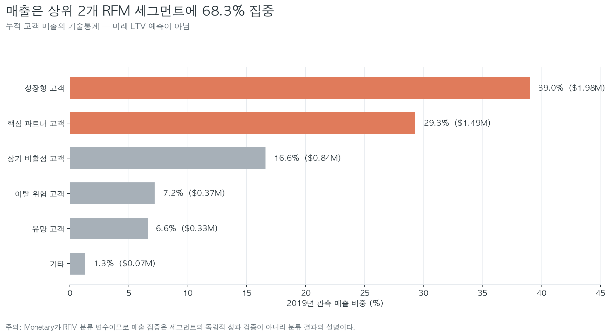
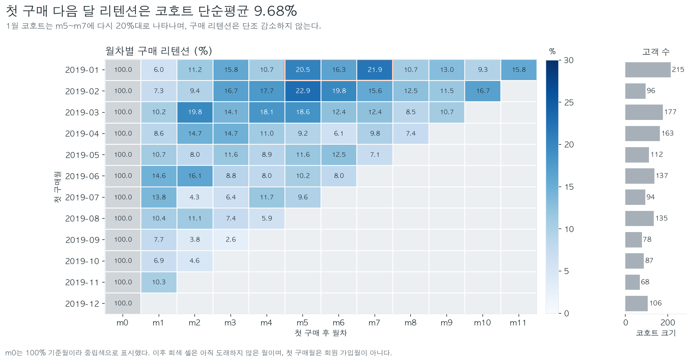
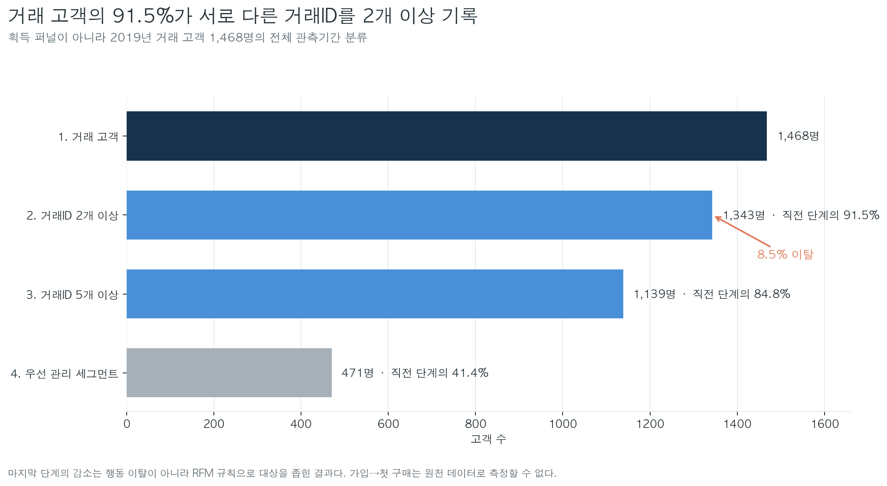
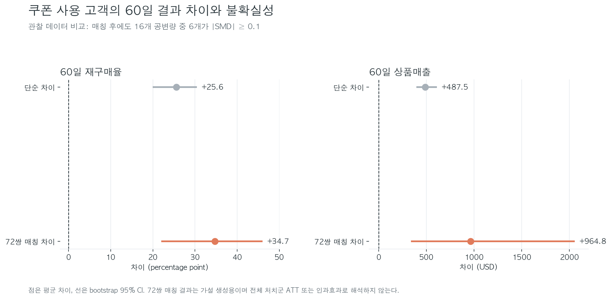
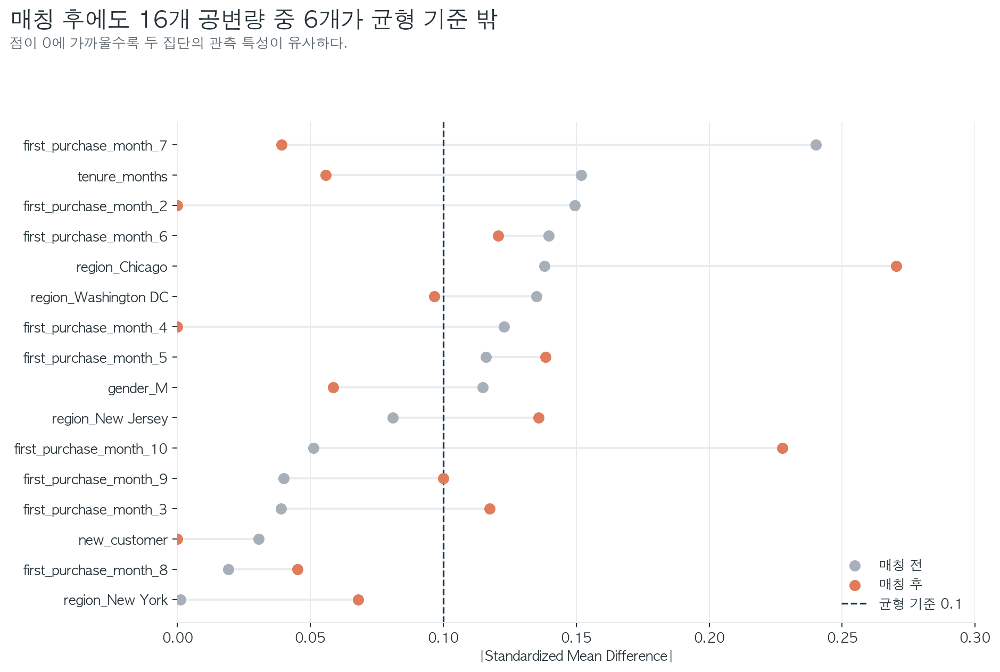

# 이커머스 고객 세분화와 재구매 분석

2019년 이커머스 거래 52,924행·고객 1,468명을 RFM 세그먼트, 첫 구매월 코호트, 구매 간격, 쿠폰 사용 관찰연구로 분석한 프로젝트입니다. 2025년 4인 팀 분석을 바탕으로 SQL 파이프라인과 검증·실험 설계를 단독 확장했습니다.

> 핵심 목표는 “복잡한 기법을 많이 사용했다”가 아니라, 고객가치 집중과 재구매 시점을 측정하고 관찰 데이터에서 얻은 가설을 다음 실험으로 연결하는 것입니다.

## 30초 요약

| 질문 | 확인한 사실 | 의사결정 해석 |
|---|---|---|
| 매출은 어디에 집중되는가? | 성장형 + 핵심 파트너가 관측 매출의 **68.3%** | 우선 관리 대상의 규모를 설명하되, Monetary가 세그먼트 변수라 독립적 성과 검증으로 해석하지 않음 |
| 첫 구매 이후 언제 약해지는가? | 관측 가능한 첫 구매월 코호트의 **m1 리텐션 단순평균 9.68%** | 첫 구매 다음 달이 CRM 실험의 우선 구간 |
| 거래 활동 단계는 무엇을 말하는가? | 고객 1,468명 중 **1,343명(91.49%)**이 서로 다른 거래ID를 2개 이상 기록 | 가입→첫 구매 funnel이 아니라 구매 고객의 전체 관측기간 분류 |
| 쿠폰 사용 고객은 이후 행동이 다른가? | 72쌍 매칭 표본에서 60일 재구매율 **+34.72%p**, 상품매출 **+$964.75** 차이 | 매칭 후에도 6/16 공변량이 불균형하므로 인과효과가 아닌 A/B 테스트 가설로 사용 |

## 분석 스토리

### 1. 매출 집중: 크기는 보이되, 분류 정의를 함께 본다



성장형과 핵심 파트너가 전체 관측 매출의 68.3%를 차지합니다. 다만 RFM의 `M`이 누적 매출이므로 이 결과에는 정의상 집중이 포함됩니다. 따라서 “RFM이 고가치 고객을 발견했다”보다 “해당 규칙으로 분류하면 관리 대상과 매출 규모가 이렇게 나뉜다”가 정확한 해석입니다.

### 2. 코호트: 첫 구매 다음 달이 가장 약한 구간이다



코호트의 기준은 가입일이 아니라 **첫 구매월**입니다. 관측 가능한 11개 코호트의 m1 리텐션 단순평균은 9.68%이며, 1월 코호트는 m5~m7에 20%대로 다시 나타납니다. 이 반등은 인과적 시즌 효과가 아니라 재구매 시점 또는 계절성 가설입니다.

### 3. 거래 단계: 이 차트는 획득 funnel이 아니다



원본 `Customer`와 `Onlinesales`의 고객 수가 모두 1,468명이라 비구매 가입자를 관측할 수 없습니다. 따라서 가입→첫 구매 전환율은 측정할 수 없고, `Frequency`도 전체 기간의 서로 다른 거래ID 개수입니다. 같은 날 여러 거래ID가 존재하므로 이를 시간상 재구매와 동일시하지 않습니다.

### 4. 쿠폰 분석: 효과 확정이 아니라 실험 가설 생성





쿠폰 `Used` 고객과 `Clicked only` 고객을 비교하면 양의 차이가 보입니다. 그러나 1:1 매칭은 1,208명 처치군 중 72명만 사용했고, 매칭 후 16개 공변량 중 6개가 `|SMD| ≥ 0.1`입니다. 현재 결과는 전체 처치군 ATT나 인과효과로 보고하지 않으며, 무작위 실험의 방향과 민감도 범위를 정하는 탐색 결과로 사용합니다.

## 지표 정의

| 지표 | 이 프로젝트의 정의 | 해석 제한 |
|---|---|---|
| RFM Frequency | 고객별 `COUNT(DISTINCT 거래ID)` | 구매일수·재구매 횟수와 같지 않음 |
| 코호트 월 | 고객의 첫 거래가 발생한 달 | 실제 회원 가입월이 아님 |
| 월차 리텐션 | 첫 구매월 고객 중 월차 N에 거래한 고유 고객 비율 | 마지막 코호트는 관측기간이 짧음 |
| 관측 고객가치 | 2019년 내 고객당 누적 매출 | 미래 LTV 예측이 아님 |
| IPT | 고객의 서로 다른 구매일 사이 간격 | 같은 날의 복수 거래ID는 하나의 구매일로 압축 |
| 매칭 차이 | 매칭된 72쌍의 평균 outcome 차이 | 모집단 ATT 또는 확정적 인과효과가 아님 |

12개월 데이터로 미래 생애가치를 안정적으로 예측하기 어려워 `LTV` 대신 관측 누적매출·활성월·구매일수·구매일 간격을 분리합니다. 정의와 사용 범위는 [관측 고객가치 지표](reports/customer_value_methodology.md)에 정리했습니다.

## 데이터와 분석 범위

| 항목 | 내용 |
|---|---|
| 데이터 | 데이콘 이커머스 고객 세분화 분석 아이디어 경진대회 데이터 |
| 기간 | 2019-01-01 ~ 2019-12-31 |
| 규모 | 거래 행 52,924개, 고객 1,468명 |
| 원본 테이블 | Onlinesales, Customer, Discount, Marketing, Tax |
| SQL 엔진 | **BigQuery Standard SQL 기준** |
| Python | pandas, statsmodels, matplotlib, seaborn |
| 기여 | 팀 프로젝트 기여 30%: EDA·전처리·해석·시각화 / 개인 구현: SQL·코호트·매칭 분석·재현성 검증·실험 설계 |

## 재현 방법

### 1. 환경 설치

```bash
python -m venv .venv
source .venv/bin/activate
pip install -r requirements.txt
```

### 2. 원본 데이터 준비

[데이콘 데이터 페이지](https://dacon.io/competitions/official/236222/data)에서 원본 파일을 받은 뒤 `data/`에 둡니다. 원본은 이용 조건과 개인정보 보호를 위해 저장소에 포함하지 않습니다. BigQuery에는 `ecomm_raw` 데이터셋으로 업로드합니다.

### 3. SQL 실행

```text
sql/00_data_quality.sql
sql/01_customer_master.sql
sql/02_purchase_activity_ladder.sql
sql/03_purchase_cohort_retention.sql
sql/04_customer_value.sql
sql/05_coupon_observational_population.sql
```

프로젝트 ID는 현재 `ecomm-extension`으로 작성되어 있어 자신의 BigQuery 프로젝트에 맞게 바꿔야 합니다. 쿼리 실행 전 조인 키 중복, 기간, NULL, 쿠폰 상태 분포를 먼저 확인해야 합니다.

### 4. 검증과 포트폴리오 차트

```bash
make check
```

README 차트는 원본을 공개하지 않아도 다시 만들 수 있도록 `data/derived/`의 비식별 집계 스냅샷을 사용합니다. `make check`로 집계 검증, Tableau용 집계 생성, 차트 재생성을 한 번에 실행할 수 있습니다.

원본 CSV를 준비한 경우 다음 명령으로 고객 세그먼트·활동 단계·코호트 집계를 공개 스냅샷과 대조할 수 있습니다.

```bash
python scripts/validate_source_data.py \
  --sales data/Onlinesales_info.csv \
  --discount data/Discount_info.csv \
  --tax data/Tax_info.csv
```

쿠폰 고객 단위 중간 파일은 식별자를 포함하므로 Git에 저장하지 않습니다. 원본에서 로컬 생성한 뒤 비식별 집계만 갱신합니다.

```bash
python scripts/build_coupon_population.py \
  --sales data/Onlinesales_info.csv \
  --customers data/Customer_info.xlsx \
  --output data/coupon_population_private.csv

python scripts/run_coupon_matching.py \
  --input data/coupon_population_private.csv \
  --effects-output data/derived/matched_effects.csv \
  --balance-output data/derived/matched_balance.csv
```

## 저장소 구조

```text
.
├── data/
│   ├── README.md
│   └── derived/                 # 공개 가능한 집계 결과
├── reports/                     # 방법론·실험 설계 상세
├── scripts/                     # README 차트 재생성
├── sql/                         # BigQuery Standard SQL
├── tableau/                     # 대시보드 설계와 비식별 연결 데이터
├── visualizations/              # 분석 차트
└── requirements.txt
```

## 현재 한계와 다음 개선

- **고객가치**: 공개 집계는 동일 원천의 pandas 독립 구현과 대조했습니다. BigQuery 테이블은 인증 가능한 환경에서 최종 재실행이 필요합니다.
- **매칭 분석**: 원본→모집단→72쌍 매칭을 로컬에서 재실행했습니다. 잔여 불균형 때문에 인과 주장은 보류하며, 처치 정의와 time-zero를 재검토해야 합니다.
- **실험 설계**: 기존 설계서의 baseline과 MDE는 관찰 매칭 표본에서 가져온 값이라 운영 데이터 사전 측정으로 다시 산정해야 합니다.
- **대시보드**: Tableau 연결용 비식별 데이터와 설계는 완성했습니다. 이 환경에는 Tableau가 없어 워크북·Public URL은 아직 없으며, 게시 전까지 “완료”로 표시하지 않습니다.
- **재현성**: 공개 가능한 집계 스냅샷·검증 테스트·차트 빌드 CI를 추가했습니다. 원본 데이터와 BigQuery 결과의 완전 재실행은 데이터 이용 권한과 GCP 환경이 필요합니다.

## 상세 문서

- [코호트·구매 간격 발견](reports/cohort_retention_findings.md)
- [관측 고객가치 지표](reports/customer_value_methodology.md)
- [쿠폰 매칭 분석 방법론](reports/psm_methodology.md)
- [쿠폰 분석 식별 가능성 검토](reports/causal_identification_review.md)
- [A/B 테스트 설계 초안](reports/ab_test_design.md)
- [Tableau 대시보드 설계 초안](tableau/dashboard_spec.md)
- [시각화 인덱스](visualizations/README.md)
- [SQL 실행 순서와 해석 가드레일](sql/README.md)
- [재현성 점검 결과](reports/reproducibility.md)

---

최진원 · [GitHub](https://github.com/jinwon25) · 2025–2026
